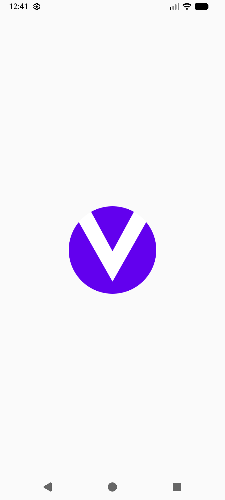
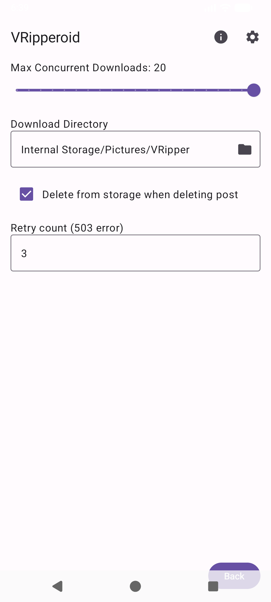
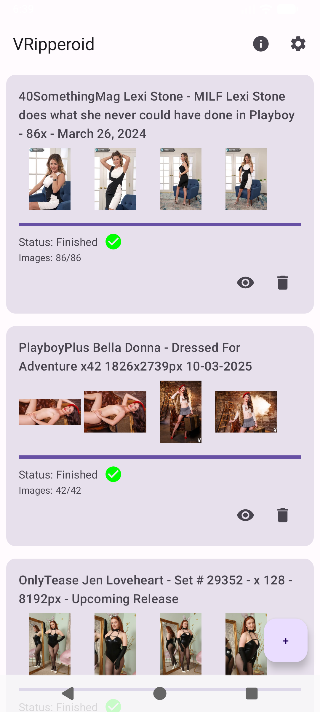

# VRipperoid

<div align="center">
  
  <br>
  <b>A modern, native Android gallery downloader for ViperGirls forum.</b>
</div>

<br>

## 📱 Screenshots

<div align="center">
  <!-- Upload screenshots to your repo and link them here -->
  
  
  
</div>

## ✨ Features

*   **Thread Parsing**: Simply paste a ViperGirls thread URL (or mirror link), and VRipperoid will extract all images.
*   **Mirror Support**: Supports parsing links from official mirrors like `planetviper.club`, `viper.to`, etc.
*   **Batch Downloading**: Automatically queues and downloads all images from a thread.
*   **Advanced Scheduling**:
    *   **FIFO Queue**: Downloads are processed strictly in the order they appear in your list (Top-to-Bottom).
    *   **Parallel Downloading**: Fine-tune performance with separate controls for **Max Concurrent Posts** and **Max Concurrent Images** (per post).
*   **Smart Handling**:
    *   **Multiple Posts**: Threads with multiple posts are split into separate queues.
    *   **Folder Management**: Files are saved directly to your chosen folder. Unique naming (`Title_PostID`) prevents conflicts.
    *   **Duplicate Detection**: Prevents adding the same post twice.
    *   **Retry Logic**: Automatically retries downloads on `503 Service Unavailable` errors.
    *   **Manual Retry**: "Refresh" button available for posts with incomplete or failed downloads.
*   **Download Management**:
    *   Pause/Resume support.
    *   **Multi-Selection**: Select multiple posts to Start or Delete them in batch.
    *   **Status Indicators**: Clear visual cues for finished (✅) and failed (❌) downloads.
    *   **Delete from Storage**: Option to delete downloaded files from disk when removing a post from the app.
*   **Customization**:
    *   Choose custom download directory (SD Card support via Storage Access Framework).
    *   Configure global concurrency limits.
*   **Privacy**: Mimics browser behavior (User-Agent, Headers) to bypass basic bot protections.

## 🛠 Supported Image Hosts

VRipperoid supports the same wide range of image hosts as the core VRipper project, including:
*   imagebam.com
*   imagetwist.com
*   imgbox.com
*   pixhost.to
*   pornimge.com
*   ...and many more.

## 🏗 Building from Source

To build VRipperoid yourself, you will need **Android Studio Ladybug (or newer)** and **JDK 17+**.

1.  **Clone the repository**:
    ```bash
    git clone https://github.com/mitro4/vripperoid.git
    cd vripper-android
    ```

2.  **Open in Android Studio**:
    *   Select "Open" and choose the cloned folder.
    *   Wait for Gradle sync to complete.

3.  **Build**:
    *   For a debug build (testing):
        Run `Build > Make Project` or simply press the **Run** (▶️) button to deploy to your connected device/emulator.
    *   For a release build (signed APK):
        You will need to generate your own Keystore and configure `local.properties`.

## ℹ️ Acknowledgements

This project is a native Android implementation partially based on the core logic of [VRipper by dev-claw](https://github.com/dev-claw/vripper-project). We reused the robust parsing logic and host extraction algorithms to ensure compatibility and reliability.

## 📥 Download

**[Download latest APK](https://github.com/mitro4/vripperoid/releases/tag/v0.1.8)**
